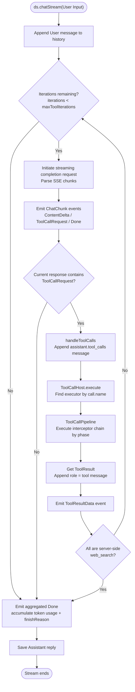

# deepseek-helper

[](https://central.sonatype.com/artifact/io.github.hatoyuze/deepseek-helper)
[](https://github.com/HatoYuze/deepseek-helper/actions/workflows/gradle.yml)


[English Version](README-en.md) | [简体中文](README.md)


**deepseek-helper** is a Kotlin Multiplatform (KMP) library that wraps the [DeepSeek API](https://api-docs.deepseek.com/) using a full `ktor` technology stack.

It supports interruption, regeneration, custom Tool Call behavior, FIM completion, and more, and provides a simple DSL syntax for usage.

### Quick Integration

```kotlin
// build.gradle.kts (commonMain)
dependencies {
    implementation("io.github.hatoyuze:deepseek-helper:0.2.0")
}
```

> **Platforms**: JVM / Android (minSdk 21) / iOS (arm64, x64, simulator) / macOS (arm64) / Linux (x64, arm64) / Windows (mingw) / JS / WasmJS.  
> **Default engines**: `CIO` for JVM & Native, `OkHttp` for Android, `js` for JS/Wasm.

### Quick Start

To call the DeepSeek API, you need a `Deepseek` instance.

> A `Deepseek` instance has no lifecycle restrictions; `deepseek-helper` provides a built-in `DeepseekHttpClientPool` to **reuse** the enabled `HttpClient`.

```kotlin
@Serializable
data class WeatherResult(val city: String, val weather: String, val temp: Int)

val ds = deepseek("<Your Deepseek Key>") { // Use DSL to build a Deepseek instance
    prompt = "You are a helpful assistant." // System prompt, placed outside the config block
    config {
        thinkingMode = ThinkingMode.Max // Maximum reasoning strength (thinking enabled by default)
    }
    model { pro() }
    tools {
        tool("get_weather") {
            parameters {
                string("city") { required = true }
            }
            description = "Get weather information for a specified city, including weather, temp, etc."
            execute { bag, _ -> // bag is the container for parameters passed by the agent
                // deepseek-helper uses kotlin.serialization to automatically serialize data classes to readable JSON
                WeatherResult(city = bag.getString("city"), weather = "Sunny", temp = 25)
            }
        }
    }
}
```

Of course, you can also use a simpler creation method, e.g.

```kotlin
val ds = Deepseek("<Your Deepseek Key>") // Directly build a Deepseek instance
```

If no model is explicitly specified, the library defaults to the hardcoded `deepseek-v4-flash`. It does **not** fetch available models from `/model`. To retrieve the latest model list for your account, call `ds.availableModels()` and select a model using `Model.ofModel`.

Then, you can start a chat:

```kotlin
val response = ds.chatStream("Hello, what's the weather in Shanghai now?") 
                .collectResponse() // This is a suspend function

println(response.thinkingContent)
println(response.content)
```

> `deepseek-helper` uses the streaming API by default, so `chatStream` returns a `Flow<ChatChunk>`. You can use `.collectResponse()` on this `Flow` to collect the stream.

If you need real-time processing, you can also use our built-in declarative functions, e.g.

```kotlin
fun printlnThinkingContent(content: String) {
    content.lines().forEach { line ->
        println(">  $line")
    }
}

val response = ds.chatStream("Hello")
    .onThinking { print("$it") }
    .onContent { print(it) }
    .onToolCall {
        println("🔧 ${it.call.name}(${it.call.arguments})")
    }
    .collectResponse()

if (response.content.isNotEmpty()) {
    println(response.content)
}
println("── ${response.usage.totalTokens} tokens")
```

Each `Deepseek` instance holds all chat history in the conversation. You can truncate the chat history to a specified index using `ds.truncateAt(index)` (irreversible).

> By default, `Deepseek` instances automatically store chat history. If you do not need history, you can use the **stateless client** `StatelessDeepseek`, which has similar invocation logic to `Deepseek`.

If you want to interrupt a stream, use `cancelStream()`. It cancels the stream
collection coroutine and aborts the underlying request (closes the connection and
stops server-side generation), so the caller's `collect` / `collectResponse()` will
throw a `CancellationException`, which should be handled as a normal cancellation.

`Deepseek` keeps single-session semantics: at most one active stream exists at a time
(`chatStream` / `continueStream` / `fimStream` all participate), a new stream cancels
the previous one, and `cancelStream()` cancels the current stream.

`StatelessDeepseek` supports concurrent streams: multiple chat/FIM streams can run at
once, and `cancelStream()` cancels all active streams on that instance. To cancel a
single task, cancel the corresponding `collect` coroutine from the caller side.

#### Support for the `/responses` API

After DeepSeek added support for the `/responses` API style, we have also implemented a wrapper for this API and mapped it to the standard `Deepseek.chatStream` API:

You can enable this in the `config` block:

```kotlin
val response = deepseek("<Your Deepseek Key>") { // Use DSL to build a Deepseek instance
    prompt = "You are a helpful assistant." // System prompt, placed outside the config block
    config {
        thinkingMode = ThinkingMode.Max // Maximum reasoning strength (thinking enabled by default)
        api = DeepseekApi.RESPONSES // Declare that `/responses` API will be used as the implementation of `chatStream`
        enableWebSearch = true // Enable search via the official `web_search`; currently only effective when `api = DeepseekApi.RESPONSES`
    }
    model { flash() }
}
```

This maps `/responses` events to the currently supported `ChatChunk` types:

<details>
<summary>View the event mapping table</summary>

| Event Name                                                                                                              | Behavior                                                                           |
|-------------------------------------------------------------------------------------------------------------------------|------------------------------------------------------------------------------------|
| `response.created`, `response.in_progress`                                                                              | No action                                                                          |
| `response.output_item.added`, `response.output_item.done`                                                               | Adds metadata to internally cached tool calls                                      |
| `response.content_part.added`, `response.content_part.done`,`response.reasoning_text.done`, `response.output_text.done` | No action                                                                          |
| `response.reasoning_text.delta`                                                                                         | Emits `ChatChunk.ContentDelta` with content mapped to `reasoningContent`           |
| `response.output_text.delta`                                                                                            | Emits `ChatChunk.ContentDelta` with content mapped to `content`                    |
| `response.function_call_arguments.done`, `response.custom_tool_call_input.done`                                         | Emits `ChatChunk.ToolCallRequest`                                                  |
| `response.function_call_arguments.delta`, `response.custom_tool_call_input.delta`                                       | Populates arguments for internal tool calls                                        |
| `response.web_search_call.in_progress`, `response.web_search_call.searching`                                            | No action                                                                          |
| `response.web_search_call.completed`                                                                                    | Emits a special `ChatChunk.ToolCallRequest` with tool name `_deepseek__web_search` |
| `response.completed`, `response.incomplete`                                                                             | Emits `ChatChunk.Done`                                                             |
| `response.failed`                                                                                                       | Throws a `PipelineException` error                                                 |

</details>


#### FIM Completion API (Beta)

`fimStream` requests `{baseUrl}/beta/completions` (the official
`https://api.deepseek.com` by default). It uses
`modelForFim` (default `deepseek-v4-pro`) and reuses `maxTokens`, `temperature`,
`topP`, `stop`, `includeUsage`, and `topLogprobs` from `config`.

```kotlin
val ds = deepseek("<Your Deepseek Key>") {
    model { pro() } // The official FIM API currently supports only deepseek-v4-pro
}

val response = ds.fimStream(
    prompt = "def add(a, b):",
    suffix = "    return a + b",
).collectFimResponse()

println(response.text)
println("Used ${response.usage.totalTokens} tokens")
```

### Some Features

#### HttpClient Pool

By default every client shares `DeepseekHttpClientPool.Global`. Each instance can
use its own pool and tune timeouts or retries through the DSL:

```kotlin
val ds = deepseek("<Your Deepseek Key>") {
    pool {
        config {
            connectTimeoutMillis = 60_000
            maxRetries = 2
        }
    }
}
```

> **IMPORTANT** When the pool is `DeepseekHttpClientPool.Global`, `pool { }` first
> copies it into an instance-level pool before applying changes, so the global
> shared configuration is never modified.

#### Custom API Provider (baseUrl)

By default every request (chat / models / balance / FIM) is sent to the official
`https://api.deepseek.com`. The `baseUrl` parameter points the client at any
OpenAI/DeepSeek-compatible API provider (proxy, gateway, or self-hosted endpoint);
both `Deepseek` and `StatelessDeepseek` support it:

```kotlin
// Constructor
val ds = Deepseek("<Your Key>", baseUrl = "https://my-provider.example.com/v1")

// DSL
val stateless = statelessDeepseek("<Your Key>") {
    baseUrl = "https://my-provider.example.com/v1"
    model { custom("my-model") } // Third-party providers usually need a custom model id
}
```

- `baseUrl` must be an absolute `http(s)` URL; invalid values throw
  `IllegalArgumentException` when the client is created
- Path prefixes are supported (e.g. `/v1` above); requests go to `{baseUrl}/chat/completions`
- A trailing `/` is stripped automatically, so `https://host/` equals `https://host`;
  userinfo (`https://user@host`), query (`?…`), and fragment (`#…`) are rejected
- `http://` transmits the API key in cleartext — use only for local proxies/testing
- Clients with different `baseUrl` values use separate pooled HTTP clients; the pool caches
  per baseUrl without eviction, so keep the baseUrl cardinality bounded (a few per provider/
  gateway) and call the pool's `close()` when appropriate to release resources
- `/models`, `/user/balance`, and FIM (`/beta/completions`) availability depends on the
  provider; unsupported endpoints return server-side errors

#### Tool Call Pipeline Design

For the tool call handling logic, this project adopts a pipeline design: each tool call is not executed directly, but first enters an interceptor chain composed of multiple phases. It passes through each phase before finally reaching the core executor. This allows cross-cutting concerns such as authentication, parameter validation, deserialization, retry, timeout, and logging to be plugged into the chain as "plugins" without invading the tool's business code.

A complete conversation (including tool call loops) roughly flows as follows:



Inside the pipeline, each phase can host any number of interceptors (components); interceptors within the same phase are executed in FIFO order (the earlier registered have lower priority).

The `ToolCallHost` holds all installed tool call functions. Each `Deepseek` instance is independent, and you can modify related content via `ChatConfig`.

<details>
<summary>Learn how to provide custom components for the ToolCallPipeline interceptor chain</summary>

> Several plugins are already built-in under `io.github.hatoyuze.deepseek.toolcall.pipeline.plugins`. You can install them using `PLUGIN.install(host)`.
>
> <details>
> <summary>Quick overview of built-in plugins</summary>
>
> | Plugin              | Phase    | Behavior                                                                                                                                                |
> |---------------------|----------|---------------------------------------------------------------------------------------------------------------------------------------------------------|
> | `RetryPlugin`       | `EXECUTE`| Catches `PipelineException` and retries with exponential backoff; other exceptions are converted to `PipelineException`; `PipelineException(isRetryable = false)` will not be retried |
> | `TimeoutPlugin`     | `EXECUTE`| Wraps the inner execution with `withTimeout`, throwing a `PipelineException` on timeout                                                                 |
> | `LoggingPlugin`     | All phases | Logs entry/exit and duration for each phase                                                                                                             |
> | `SerializationPlugin` | `TRANSFORM` | Automatically deserializes parameters for `TypedToolExecutor` and writes them to `ctx.typedParams`                                                      |
>
> > **These plugins are not installed by default**. You can install them by calling `retry()`, `timeout()`, `logging()` inside the `tools { }` DSL block (provided by `io.github.hatoyuze.deepseek.toolcall.dsl.ToolCallBuilderKt`).
>
> **Note: These plugins only affect retries at the toolcall level and do not affect the outer stream.**
> </details>
>
> Each pipeline plugin is invoked only at its specified phase, and there is a defined order of invocation.
>
> Phases are executed **sequentially** (the previous phase must finish before the next), while multiple interceptors within the same phase are **nested**:
>
> ```mermaid
> flowchart LR
>     subgraph PIPELINE["ToolCallPipeline Interceptor Chain"]
>         direction TB
>         V["VALIDATE<br/>Parameter Validation"] --> A["AUTHORIZE<br/>Authorization"]
>         A --> T["TRANSFORM<br/>Parameter Deserialization"]
>         T --> E["EXECUTE<br/>Core Execution"]
>         E --> P["POST_PROCESS<br/>Post-Processing"]
>         P --> R["ERROR<br/>Finalization Phase"]
>     end
>     CALL["ToolCallHost.execute(call)"] --> PIPELINE
>     PIPELINE --> RESULT["ToolResult"]
> ```
>
> ```mermaid
> sequenceDiagram
>     participant H as ToolCallHost
>     participant OUT as Outer Interceptor<br/>(registered later)
>     participant IN as Inner Interceptor<br/>(registered earlier)
>     participant CORE as Core Executor<br/>(innermost EXECUTE)
>     H->>OUT: execute(call, ctx)
>     OUT->>IN: ctx.proceed()
>     IN->>CORE: ctx.proceed()
>     CORE-->>IN: ToolResult
>     IN-->>OUT: return
>     OUT-->>H: ToolResult
> ```
>
> If you want to register a custom pipeline plugin, refer to the existing code for guidance.
>
> A simple authorization plugin:
>
> ```kotlin
> // import io.github.hatoyuze.deepseek.toolcall.pipeline.* / io.github.hatoyuze.deepseek.toolcall.dsl.toolHost
> class AuthPlugin(private val requiredPermission: String) {
> 
>     fun install(host: ToolCallHost) {
>         // Attach to AUTHORIZE phase: all tool calls pass through here first
>         host.intercept(ToolCallPhase.AUTHORIZE) { ctx ->
>             if (requiredPermission !in ctx.executionContext.permissions) {
>                 // Throw a business exception: the pipeline will convert it to ToolResult.error and return it to the model
>                 throw PipelineException(
>                     "Insufficient permission: need $requiredPermission",
>                     isRetryable = false, // Mark as non-retryable to avoid repeated execution by RetryPlugin
>                 )
>             }
>             ctx.proceed() // Permission passed, proceed to inner layers
>         }
>     }
> }
> 
> // Build the host first, then install the custom plugin
> val host = toolHost {
>     tool("get_balance") {
>         description = "Query account balance"
>         parameters { }
>         execute { _, _ -> """{"balance": 100}""" }
>     }
> }
> AuthPlugin("user:finance").install(host)
> 
> val ds = deepseek("sk-...") {
>     executionContext = ToolExecutionContext("u", "s", permissions = setOf("user:finance"))
> }
> ds.toolHost = host
> ```
>
> Custom plugins must be installed after the host is built, as shown above.
>
> Note that **exceptions interrupt the entire call chain**. Exceptions thrown inside an interceptor are caught by the pipeline, which first executes the `ERROR` phase interceptors (where you can access the original exception via `ctx.error`), then converts it to `ToolResult.error`. `CancellationException` is propagated as-is and will not be swallowed or retried. If you need "failure retry" or "fallback on exception", wrap `ctx.proceed()` with `try/catch` like the `RetryPlugin` does.
>
> <details>
> <summary>Full example: custom plugin for logging tool execution time</summary>
>
> ```kotlin
> class TimingPlugin(private val onComplete: suspend (String, Long) -> Unit) {
> 
>     fun install(host: ToolCallHost) {
>         // Attach to EXECUTE phase, as the last EXECUTE interceptor installed, it is the outermost layer
>         host.intercept(ToolCallPhase.EXECUTE) { ctx ->
>             val start = System.currentTimeMillis()
>             try {
>                 ctx.proceed() // Enter inner layers (possibly retry / timeout / core executor)
>             } finally {
>                 onComplete(ctx.call.name, System.currentTimeMillis() - start)
>             }
>         }
>     }
> }
> 
> val host = toolHost {
>     tool("search") {
>         description = "Search the internet"
>         parameters { string("q") { required = true } }
>         execute { bag, _ -> """{"query":"${bag.getString("q")}"}""" }
>     }
>     retry(maxAttempts = 3) // Registered first → closer to the core executor
>     timeout(5_000)         // Registered later → wraps the whole retry loop
> }
> // Installed last → outermost EXECUTE interceptor, measures full execution time including retries and timeouts
> TimingPlugin { name, ms -> println("$name took ${ms}ms") }.install(host)
> ```
>
> </details>
>
</details>

### License

Apache License 2.0. See [LICENSE](LICENSE).
