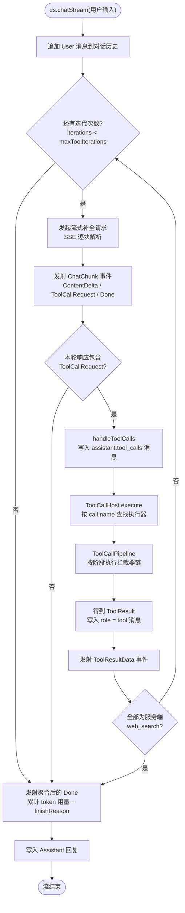
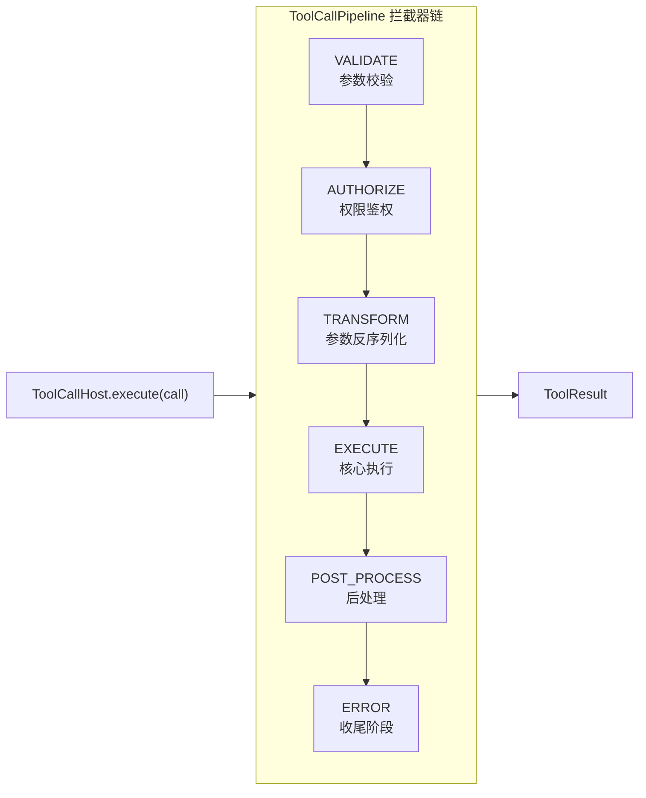
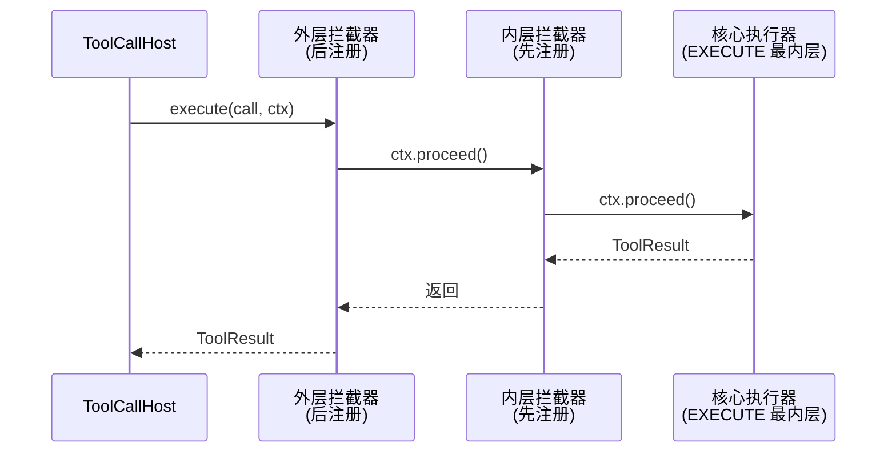

# deepseek-helper

**deepseek-helper** 是一个基于 Kotlin Multiplatform (KMP) 全 `ktor` 技术栈的 [DeepSeek API](https://api-docs.deepseek.com/) 封装库

支持`/chat/completions`的中断、重新生成、自定义 Tool Call等行为，并为使用提供了简易的 `DSL`语法.

### 使用例
为了调用`deepseek` API 你需要一个 `Deepseek` 实例
```kotlin
@Serializable
data class WeatherResult(val city: String, val weather: String, val temp: Int)

val ds = deepseek("<Your Deepseek Key>") { // 使用 DSL 语法来构建一个 Deepseek 实例
    prompt = "You are a helpful assistant." // 系统提示词，写在 config 外层
    config {
        thinkingMode = ThinkingMode.Max // 最大推理强度（默认开启思考）
    }
    model { pro() }
    tools {
        tool("get_weather") {
            parameters {
                string("city") { required = true }
            }
            description = "获取指定地点的天气，包含有 weather、temp等信息"
            execute { bag, _ -> // bag 作为获取 agent 传递的参数的容器
                // deepseek-helper 利用 kotlin.serialization 可以自动将 data class 序列化为可读的 Json
                WeatherResult(city = bag["city"] as String, weather = "晴", temp = 25)
            }
        }
    }
}
```
当然，你也可以选择一个简单点的创建办法，例如
```kotlin
val ds = Deepseek("<Your Deepseek Key>") // 直接构建 Deepseek 实例
```
未显式指定模型时默认使用库内硬编码的 `deepseek-v4-flash`，不会发起网络请求；如需按账号获取最新模型列表，可调用 `ds.availableModels()` 并通过 `Model.ofModel` / `Model.flash(available)` 选择。

随后，你可以进行一次聊天的调用:
```kotlin
val response = ds.chatStream("你好，上海现在是什么天气？") 
                .collectResponse() // 这是一个 suspend 函数

println(response.thinkingContent)
println(response.content)
```
`deepseek-helper` 默认调用`stream`流下的API，因而 `chatStream` 将会返回一个 `Flow<ChatChunk>`，对于这个`Flow`你可以直接使用`.collectResponse()` 收集流

如果你追求实时性，也可以使用我们内置的声明式函数，例如

```kotlin
fun printlnThinkingContent(content: String) {
    content.lines().forEach { line ->
        println(">  $line")
    }
}

val response = ds.chatStream("你好")
    .onThinking { print("$it") }
    .onContent { print(it) }
    .onToolCall {
        println("🔧 ${it.call.name}(${it.call.arguments})")
    }
    .collectResponse()

if (response.content.isNotEmpty()) {
    println(response.content)
}
println("── ${response.usage.totalTokens} tokens")
```

每一个 `Deepseek` 实例将会持有对话中的所有聊天记录，你可以使用 `ds.truncateAt(index)` 截断聊天记录到指定下标处(不可逆)

如果你想要中断对话，可以使用`ds.cancelStream()`。它会取消当前流的收集协程并中止底层请求（连接关闭、服务端停止生成），因此调用方的 `collect` / `collectResponse()` 会抛出 `CancellationException`，按常规取消处理即可；下一次流式调用会自动复位取消状态。

### 一些特性

#### Tool Call 管道设计

有关 `Tool Call` 的处理逻辑部分，本项目采用了管道式（pipeline）设计：每一次工具调用都不会被直接执行，而是先进入一条由多个阶段（phase）组成的拦截器链，逐层通过后才真正到达核心执行器。这样一来，鉴权、参数校验、反序列化、重试、超时、日志这类横切逻辑都可以作为"插件"挂在链上，而不必侵入工具自身的业务代码。

一次完整的对话（含工具调用循环）大致如下：



管道内部，每个阶段都可以挂载任意数量的拦截器；同一阶段内的拦截器按照FIFO(先注册的优先级更低)的顺序执行。

其中的 `ToolCallHost` 持有所有已经安装的`tool call`函数, 每一个 `Deepseek` 实例之间是独立的，你可以通过 `ChatConfig` 修改相关内容


<details>
<summary>了解如何为 ToolCallPipeline 拦截链提供自定义组件</summary>>

`io.github.hatoyuze.deepseek.toolcall.pipeline.plugins` 下已经内置了四个插件, 可以使用: `PLUGIN.install(host)` 进行按照

<details>
<summary>内置插件速览</summary>

| 插件 | 挂载阶段 | 行为 |
| --- | --- | --- |
| `RetryPlugin` | `EXECUTE` | 失败后按指数退避自动重试；`PipelineException(isRetryable = false)` 不会被重试 |
| `TimeoutPlugin` | `EXECUTE` | 用 `withTimeout` 包裹内层执行，超时抛出 `PipelineException` |
| `LoggingPlugin` | 全部阶段 | 记录每个阶段的进入/退出与耗时 |
| `SerializationPlugin` | `TRANSFORM` | 为 `TypedToolExecutor` 自动反序列化参数，写入 `ctx.typedParams` |

</details>

每一个管道插件只会在所指定的阶段被调用，且存在一定的调用顺序。

阶段之间是**顺序执行**的（前一个阶段跑完才进入下一个阶段），而同一阶段内的多个拦截器是**嵌套包裹**的：





如果你想要自行注册一个管道插件，可以参照已有的代码完成编写.

一个简单的鉴权插件：

```kotlin
// import io.github.hatoyuze.deepseek.toolcall.pipeline.* / io.github.hatoyuze.deepseek.toolcall.dsl.toolHost
class AuthPlugin(private val requiredPermission: String) {

    fun install(host: ToolCallHost) {
        // 挂在 AUTHORIZE 阶段：所有工具调用都会先经过这里
        host.intercept(ToolCallPhase.AUTHORIZE) { ctx ->
            if (requiredPermission !in ctx.executionContext.permissions) {
                // 抛出业务异常：管道会将其转换为 ToolResult.error 回传给模型
                throw PipelineException(
                    "权限不足: 需要 $requiredPermission",
                    isRetryable = false, // 标记不可重试，避免被 RetryPlugin 反复执行
                )
            }
            ctx.proceed() // 校验通过，放行给内层
        }
    }
}

// 先构建 host，再安装自定义插件
val host = toolHost {
    tool("get_balance") {
        description = "查询账户余额"
        parameters { }
        execute { _, _ -> """{"balance": 100}""" }
    }
}
AuthPlugin("user:finance").install(host)

val ds = deepseek("sk-...") {
    executionContext = ToolExecutionContext("u", "s", permissions = setOf("user:finance"))
}
ds.toolHost = host
```

目前 `tools { }` DSL 块内只内置了 `retry` / `timeout` / `logging`，自定义插件需要在 host 构建完成后再 `install`，如上所示。

需要注意的是：

- 同一阶段内"后注册的先执行"。`tools { retry(); timeout() }` 中 `timeout` 处于外层，超时预算覆盖整个重试循环；反过来声明（`timeout` 在前、`retry` 在后）时，`RetryPlugin` 会直接跳到最内层的核心执行器，`TimeoutPlugin` 反而不会生效。
- **异常会中断整条链**, 拦截器内抛出的异常会被管道捕获，先执行 `ERROR` 阶段的拦截器（可通过 `ctx.error` 拿到原始异常），再转成 `ToolResult.error`；`CancellationException` 会原样向上传播，不会被吞掉或重试。需要"失败重试"或"异常兜底"时，请像 `RetryPlugin` 一样用 `try/catch` 包住 `ctx.proceed()`。

<details>
<summary>完整示例：记录工具耗时的自定义插件</summary>

```kotlin
class TimingPlugin(private val onComplete: suspend (String, Long) -> Unit) {

    fun install(host: ToolCallHost) {
        // 挂在 EXECUTE 阶段，作为最后一个安装的 EXECUTE 拦截器，它位于最外层
        host.intercept(ToolCallPhase.EXECUTE) { ctx ->
            val start = System.currentTimeMillis()
            try {
                ctx.proceed() // 进入内层（可能是 retry / timeout / 核心执行器）
            } finally {
                onComplete(ctx.call.name, System.currentTimeMillis() - start)
            }
        }
    }
}

val host = toolHost {
    tool("search") {
        description = "搜索互联网"
        parameters { string("q") { required = true } }
        execute { bag, _ -> """{"query":"${bag.getString("q")}"}""" }
    }
    retry(maxAttempts = 3) // 先注册 → 更靠近核心执行器
    timeout(5_000)         // 后注册 → 包裹整个重试循环
}
// 最后安装 → 位于 EXECUTE 最外层，测量包含重试/超时在内的完整执行耗时
TimingPlugin { name, ms -> println("$name 耗时 ${ms}ms") }.install(host)
```

</details>

</details>

### License

Apache License 2.0。参见 [LICENSE](LICENSE)。
